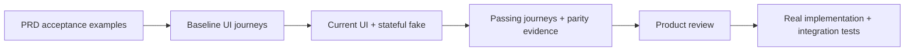

# PRD to Prototype

An AI skill for making UI features concrete before implementing their backend. It works from a PRD, runs the current application against a stateful fake, and produces a prototype the product owner can inspect through tested user journeys.

Use it for web applications, websites, native mobile apps and desktop UI. It follows the project's framework, design system and test harness. Backend-only work and production deployment are outside its scope.



The baseline run normally captures failing acceptance assertions before feature changes. Requirements already met by existing behavior can pass at baseline; record that instead of manufacturing a failure.

## What the skill enforces

- **Fresh source per PRD.** Fetch and pin the appropriate commit, then copy the UI and required build dependencies into its own prototype. Record deployment provenance separately.
- **Existing UI parity.** Preserve the home, navigation, feature-flag session branches, backgrounds, tokens and shared components unless the feature explicitly changes them.
- **Acceptance first.** Write observable product expectations and run the UI scenarios before implementing the proposed behavior.
- **Stateful mocks.** Exercise permissions, edits, reloads, failures, retries and relevant conflicts through the existing data/API interface.
- **Real journeys and evidence.** Start at the normal entry point, assert screen visits during execution and retain recordings/screenshots for every acceptance case.
- **Reviewable handoff.** Keep static designs, runtime evidence, product review and real backend delivery as separate verification layers.

The skill does not install an application framework or require Next.js, Playwright, a particular backend, or a paid service. Native verification needs the target project's native harness and an available emulator/simulator/device. Browser evidence does not establish native behavior.

## Install

The repository root is the skill folder: [`SKILL.md`](SKILL.md) contains the entrypoint and its frontmatter. The package uses the [Agent Skills format](https://agentskills.io/specification).

For Codex, clone into the skills directory (use your configured `CODEX_HOME/skills` if different):

```bash
git clone https://github.com/salismt/prd-to-prototype.git ~/.codex/skills/prd-to-prototype
```

For [Claude Code](https://code.claude.com/docs/en/skills):

```bash
git clone https://github.com/salismt/prd-to-prototype.git ~/.claude/skills/prd-to-prototype
```

For other agents, place the complete folder in their supported Agent Skills location. Keep `scripts/`, `references/` and `assets/` beside `SKILL.md`. Do not overwrite an existing installation; update its checkout deliberately. Restart or refresh your agent's skill discovery if necessary.

## Invoke

Codex:

```text
Use $prd-to-prototype with PRD-007 at docs/prds/PRD-007-profile.md.
Source: /path/to/application. Target: web. Preserve the current shell.
Build an isolated prototype with a stateful fake and acceptance evidence.
```

Claude Code:

```text
/prd-to-prototype Turn docs/prds/PRD-007-profile.md into a tested prototype.
Use the current mobile app, preserve its navigation/theme, and mock its repository.
```

Provide the PRD, source repository, target platform and scope. Existing project decisions guide the remaining choices. If a PRD needs clarification, the skill fixes its acceptance contract before changing the feature.

## Package

| Resource | Purpose |
|---|---|
| [SKILL.md](SKILL.md) | Workflow and decision rules |
| [Platform guidance](references/platforms-and-mocks.md) | Web, native and desktop mock/test seams |
| [Evidence guide](references/evidence.md) | Source parity, runner adapters and review handoff |
| [PRD template](assets/prd-template.md) | Product contract with stable requirements, screens and acceptance IDs |
| [Coverage examples](assets/coverage-contract.example.json) | Framework-independent AC/screen mapping and [result shape](assets/scenario-results.example.json) |
| [Snapshot helper](scripts/snapshot.py) | Copy selected committed paths and check explained differences |
| [Coverage checker](scripts/check_coverage.py) | Reject missing/failed/skipped/duplicate cases, missing visits and absent artifacts |
| [Codex metadata](agents/openai.yaml) | Display name and invocation example; optional for other tools |

## Helpers

Python 3.9+; Git is required for snapshots. Helpers use only the Python standard library. Run them from this skill's directory or by absolute path.

```bash
# Copies selected paths without changing the source checkout.
# The destination must not already exist.
python3 scripts/snapshot.py create \
  --repo /path/to/application --remote origin --fetch --ref origin/main \
  --path frontend --destination /path/to/prototypes/PRD-007

# Inspect specific allowed prototype changes; see the evidence guide for its schema.
python3 scripts/snapshot.py verify \
  --prototype /path/to/prototypes/PRD-007 \
  --allowlist /path/to/prototypes/PRD-007/parity-allowlist.json

# Supply actual runner-exported results and existing runtime artifacts.
python3 scripts/check_coverage.py \
  --contract /path/to/coverage-contract.json \
  --results /path/to/scenario-results.json \
  --artifact-root /path/to/prototype
```

Snapshots preserve repository-relative paths: a `frontend` selection runs from `PROTOTYPE/frontend`. Include shared packages and workspace/lock configuration needed by your app. Snapshots reject unresolved submodules, existing destinations and escaping source links. They copy commits only; explicitly requested uncommitted changes need separate provenance. They do not scan for tracked secrets or verify a deployment.

Coverage inputs must come from the test runner. The bundled JSON files are illustrative and their referenced artifacts intentionally do not exist. The checker verifies evidence records and file presence, not the truth of assertions, visual quality or recording contents. It reports product review separately from a passing mock suite.

## Validation

```bash
python3 -m unittest discover -s tests -v
```

GitHub Actions runs the helper suite on Python 3.9 and 3.13.

Helper tests use temporary synthetic repositories and artifacts. They test copying/fetching, preservation, source drift, path boundaries, actual-versus-declared visits, missing/duplicate/skipped results, stale review and CLI exit codes. These tests validate the helpers; they are not a completed web or mobile feature evaluation.

## Origin and license

Created from repeated PRD-to-prototype feature work and corrections where mocked sessions selected the wrong navigation and handcrafted designs drifted from the current app. The repository contains generalized instructions and synthetic examples; it includes no originating application code or private artifacts.

MIT © 2026 salismt. [License](LICENSE).
